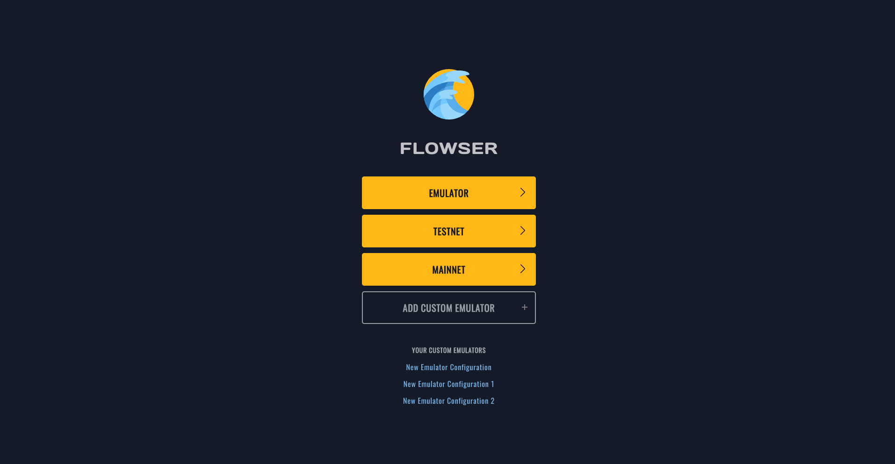
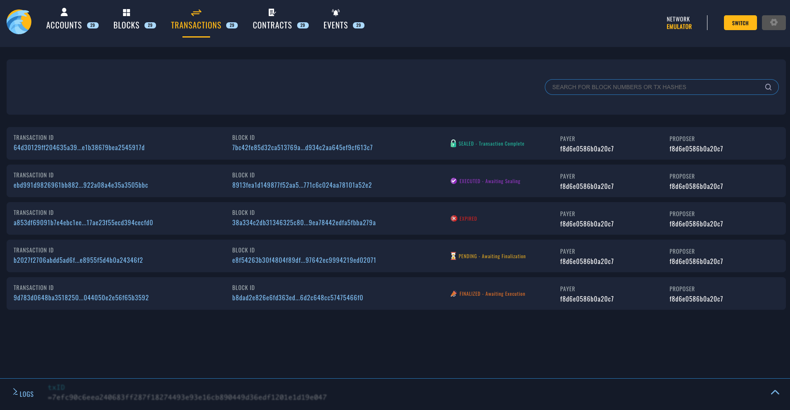
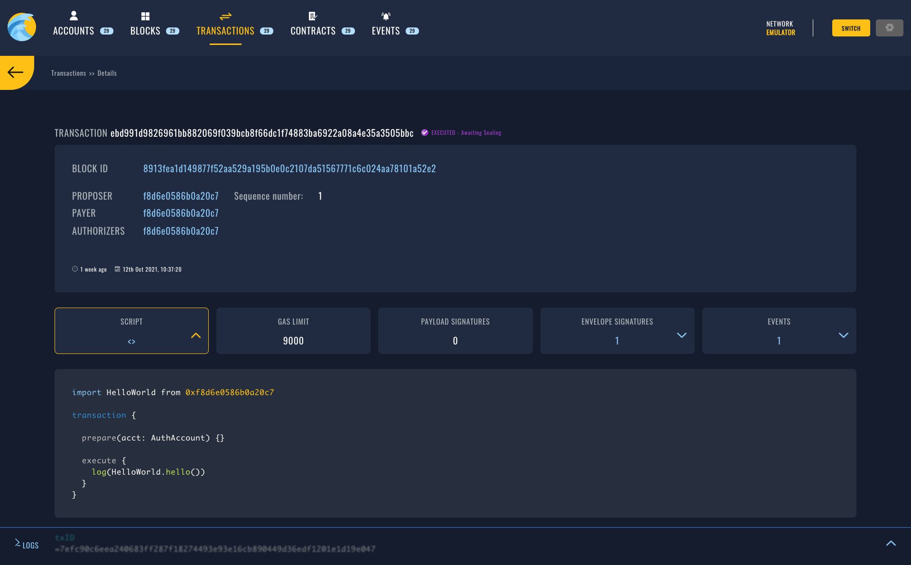

# flowser
Flowser is Flow Browser.

### UI preview

| Start page | All transactions  | Transaction details |
|---|---|---|
|  |  |  |

### Requirements
- Docker (optional to run dummy UI)
- Node.js

### Run dummy UI (without docker)

1. Install npm packages: `npm i`
2. Run the frontend app: `npm start`

### Run with docker

Application stack consist of frontend Nestjs backend API server, frontend React SPA application and Mongo database.
Use the following docker-compose commands to start up development stack and point your browser to http://localhost:3000

Make sure that you have ```.env``` file properly configured, for local development simply rename .env.sample to .env!

To get more information on frontend and backend respectively refer to README.md in /frontend and /backend folders.


Start local development stack. 
```
docker-compose up -d
```

Stop local development stack.
```
docker-compose down
```

See logs.
```
docker-compose logs -f
```
